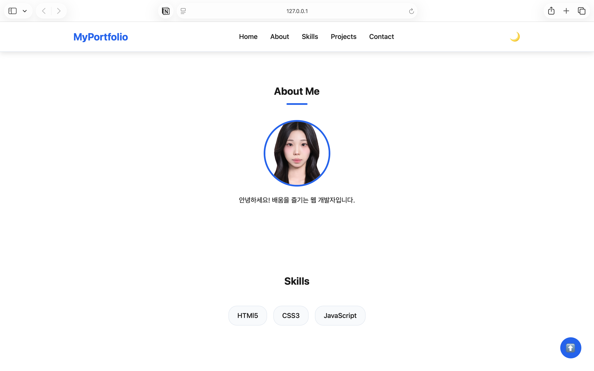
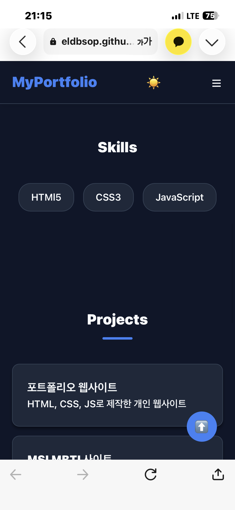
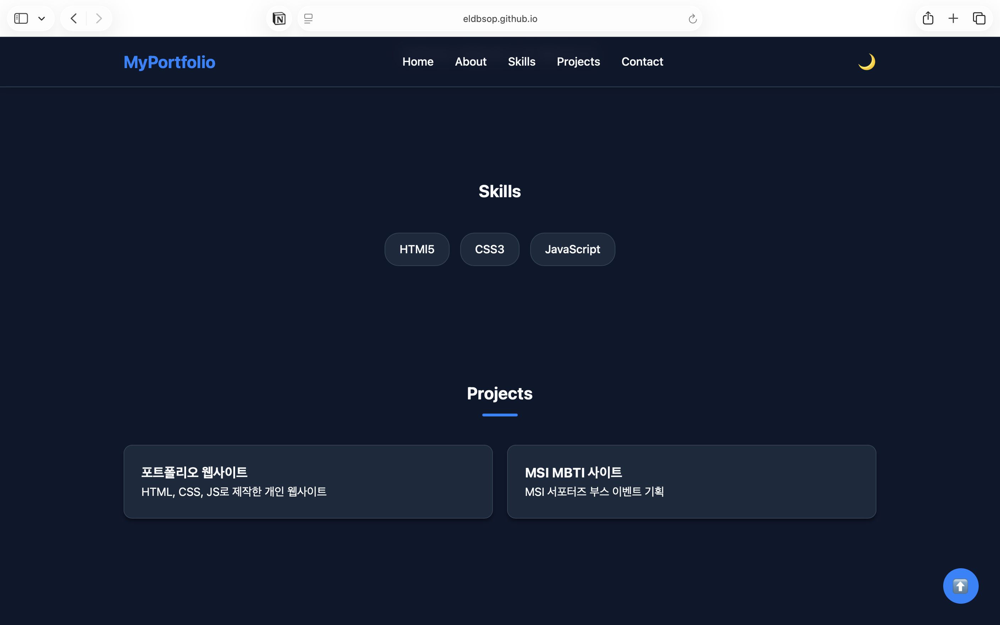

# 💻 개인 포트폴리오 웹사이트

HTML, CSS, JavaScript만을 활용하여 제작한 반응형 개인 포트폴리오 웹사이트입니다.

## 🔗 배포 URL
- **Live Site**: https://eldbsop.github.io/my-portfolio/

---

## 🛠️ 사용 기술 (Tech Stack)
- **Frontend**: HTML5, CSS3, JavaScript (ES6+)
- **Deployment**: GitHub Pages

---

## ✨ 주요 기능 및 특징
1. **반응형 웹 디자인**: 데스크톱과 모바일 환경 모두에 최적화된 레이아웃 제공
2. **다크 모드 (Dark Mode)**: 사용자 선호에 따른 테마 전환 기능 지원
3. **스크롤 애니메이션**: `Intersection Observer`를 활용하여 화면 스크롤 시 섹션 등장 효과 구현 (`threshold: 0.2` 설정)
4. **동적 네비게이션**: 스크롤 60px 이상 이동 시 상단 네비게이션 바 배경색 전환
5. **Top 버튼**: 스크롤 300px 이상 이동 시 화면 우측 하단 맨 위로 가기 버튼 노출
6. **Projects 비동기 상태 UI**: 프로젝트 데이터 요청에 따른 4가지 상태(로딩, 성공, 에러, 빈 상태) UI 제어

---

## 📸 스크린샷

| 데스크톱 (Light Mode) | 모바일 (Mobile View) | 다크 모드 (Dark Mode) |
| :---: | :---: | :---: |
|  |  |  |

